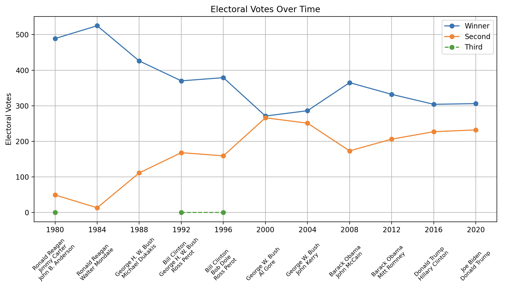
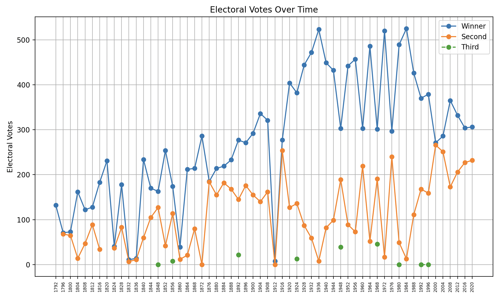

## Demo of WME Structured Contents API

US Presidential Electoral College Votes over Time from 1980 to 2020. We take a Data Science approach to collecting the data, tidying the data the way we need it, and then charting it.

Final chart of running the code in this repository:


You must have Python installed.

## Run Get - Parse - Chart Scripts

Terminal commands, from the SDK's root folder:

```
# Run the on-demand example
$ python -m example.demo.elections.get
$ python -m example.demo.elections.parse
$ python -m example.demo.elections.chart
```

To close the chart click the close button on the Window, or on the keyboard press Ctrl-C to stop the command in the terminal.

Example if we set it to start on 1792 to 2020, we adjust the year and nominees names, to make it fit nicely:


