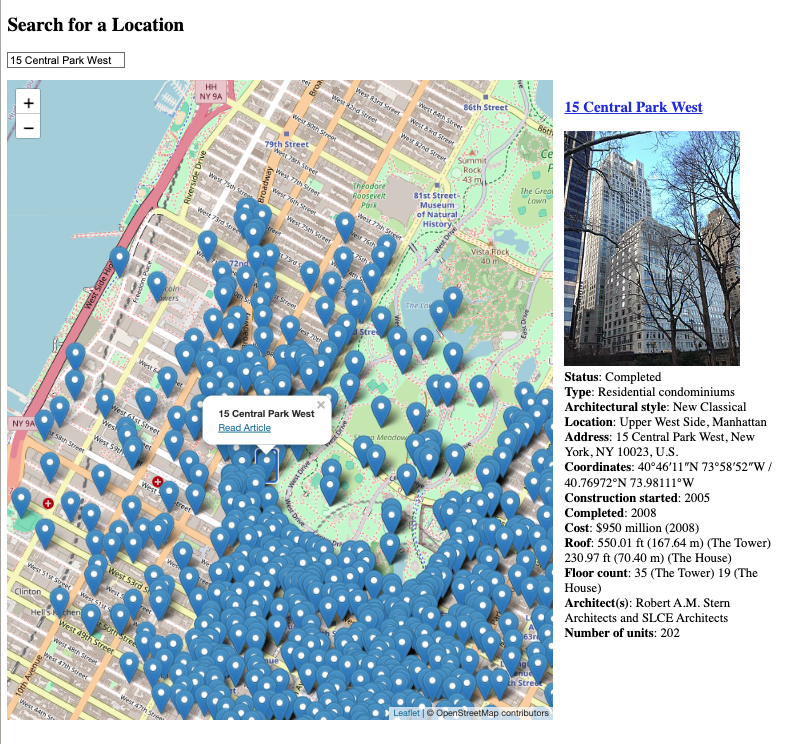

# GeoSearch Wiki Map Application

This project is a web application that allows users to search for a location by name, zoom into the map, and display nearby Wikipedia articles. It uses the following services:
- **OpenCage** for geolocation (converting place names into latitude and longitude).
- **Wikipedia API** for fetching articles near a specific latitude and longitude.
- **Wikimedia Enterprise API** to populate detailed Wikipedia infobox data when hovering over map pins.

## Features:
1. Search for a location using the search box.
2. Zoom into the selected location.
3. Display Wikipedia articles as pins on the map within a certain radius of the selected location.
4. Hover over map pins to see infobox details and images from Wikimedia Enterprise.




## Prerequisites:
1. **Wikimedia Enterprise Account** (Free)
   Sign up for a Wikimedia Enterprise account here:
   [https://dashboard.enterprise.wikimedia.com/signup/](https://dashboard.enterprise.wikimedia.com/signup/)

2. **OpenCage API Account** (Free)
   Sign up for an OpenCage API key here:
   [https://opencagedata.com/](https://opencagedata.com/)

## Environment Setup
Create a `.env` file in the project directory and save your Wikimedia Enterprise username, password, and OpenCage API key in it.

### Example `.env` file:
```bash
WME_USERNAME=your_wikimedia_username
WME_PASSWORD=your_wikimedia_password
OPENCAGE_API_KEY=your_opencage_api_key
```

## Step-by-Step Guide

### 1. Clone the Project:
First, clone this repository to your local machine.

```bash
git clone https://github.com/wikimedia-enterprise/wme-sdk-python.git
cd wme-sdk-python
# For this demo app:
cd wme-sdk-python/example/locations
```

### 2. Create a Python Virtual Environment:
Set up a Python virtual environment named `geo` to isolate project dependencies.

```bash
python3 -m venv geo
```

### 3. Activate the Virtual Environment:
Activate the virtual environment before installing the required dependencies.

- **On macOS/Linux:**
  ```bash
  source geo/bin/activate
  ```

- **On Windows:**
  ```bash
  geo\Scripts\activate
  ```

### 4. Install Project Dependencies:
Once the virtual environment is activated, install the required Python packages by running:

```bash
pip install -r requirements.txt
```
Check they all the dependencies install correctly, some may require you to install additional OS level packages.


### 5. Run the Web Server:
After the dependencies are installed, you can start the web server by running:

```bash
python app.py
```

### 6. Open the Application in Your Browser:
Open your browser and go to the following URL:

```bash
http://127.0.0.1:5000/
```

## How the Application Works:
- **Search Box**: Type the name of a location in the search box. The application will use the OpenCage API to suggest places based on the input.
- **Zoom to Location**: Once you select a location, the map will automatically zoom in to that place and display Wikipedia articles as map pins around it.
- **Article Pins**: Each pin on the map represents a Wikipedia article. Clicking a pin opens a popup with the article title and a link to the Wikipedia page.
- **Infobox Details**: Hover over any pin to fetch and display infobox details such as the article's image, key facts, and other related data. (Note: Not all Wikipedia articles have infoboxes, so some articles may not display details in the right panel.)

## API Integrations:
1. **OpenCage API**: Used for geolocation and place name suggestions based on user input.
2. **Wikipedia API**: Used to fetch nearby Wikipedia articles given a latitude and longitude.
3. **Wikimedia Enterprise API**: Used to fetch detailed infobox data when hovering over pins.

## Troubleshooting:
1. **Invalid API Keys**: Ensure you have valid API keys in the `.env` file for both OpenCage and Wikimedia Enterprise.
2. **Environment Issues**: If you have trouble with dependencies or activating the virtual environment, make sure that Python and `pip` are installed correctly on your system.
3. **Missing Infoboxes**: Not all Wikipedia articles have infoboxes, so the right panel may not update for some pins.

## License:
This project is licensed under the MIT License.
