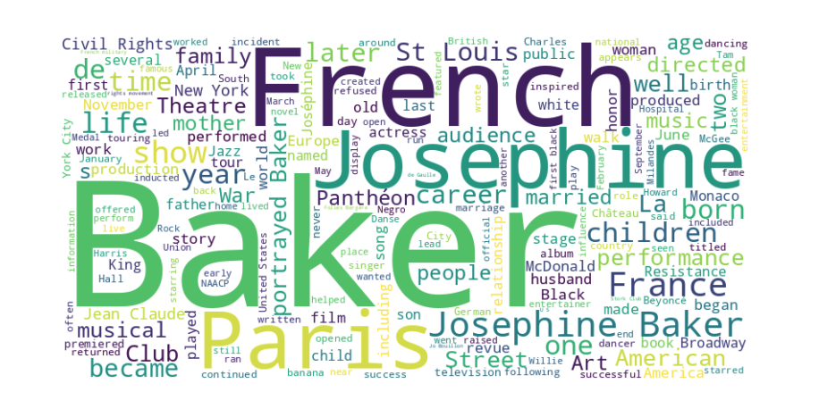

# Word Cloud Generator for Wikipedia Articles

This project is designed to download any Wikipedia article from an API, process the content, and generate both a **Word Cloud** and a **Column Chart** displaying the most frequent words found in the article.

## Features

- Download a single article based on the title provided as a command-line argument.
- Traverse the JSON response and extract deeply nested sections and paragraphs.
- Generate a Word Cloud of the most common words in the article.
- Display a Column Chart of word frequencies.

## Output
### Word Cloud - Most Frequent


### Column Chart - Word Frequency


## Requirements

To run this project, you need to have Python installed on your system along with the required dependencies specified in the `requirements.txt` file.

## Setup Instructions

1. Clone the repository.
2. Create a Python virtual environment and activate it:

    ```bash
    #In the project root folder run:
    python -m venv clo
    source clo/bin/activate
    ```

3. Install the required packages:

    ```bash
    pip install -r example/demo/word-cloud/requirements.txt
    ```

## Usage

### 1. Download an article
To download a single article, use the following command, replacing `"Josephine_Baker"` with the title of the article you want to download:

```bash
python -m example.demo.word-cloud.get "Josephine_Baker"
```

### 2. Parse and generate visualizations
To extract the text from the article and generate the **Word Cloud** and **Column Chart**, run:

```bash
python -m example.demo.word-cloud.parse "Josephine_Baker"
```


## License

This project is licensed under the MIT License.
